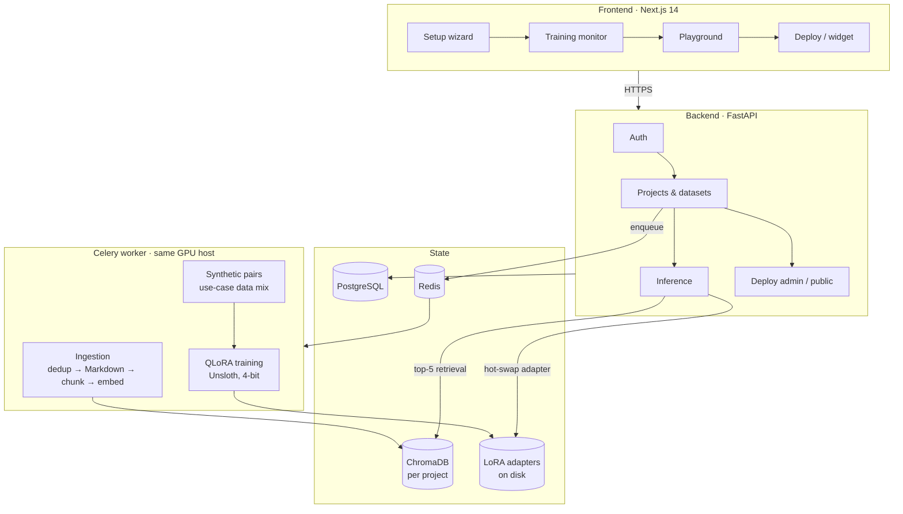
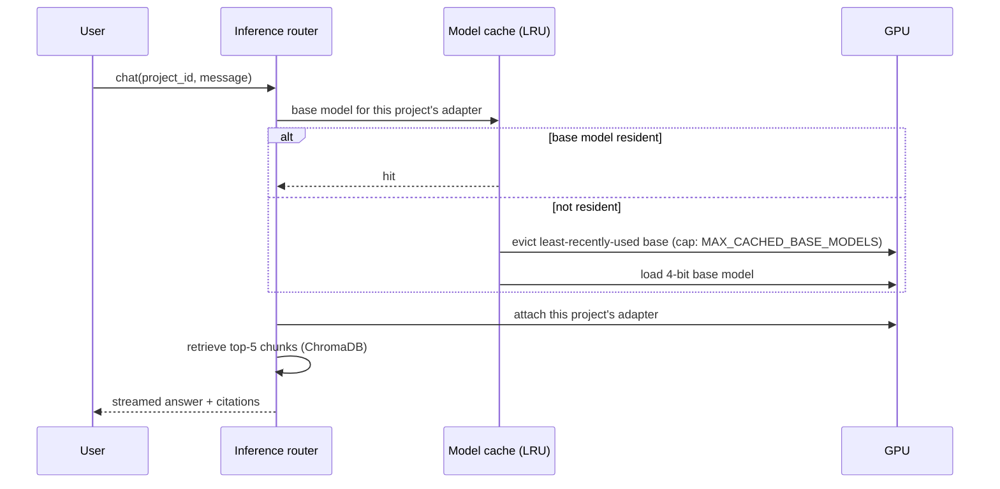

# SLM Studio

**Fine-tune and serve a private assistant on your own documents, on one 8 GB consumer GPU, without writing code.**

Upload PDFs, DOCX or TXT files, pick a use case, and SLM Studio trains a 4-bit QLoRA adapter for a small language model (1.7B–4B parameters). The resulting assistant answers from your documents through retrieval, and you can embed it on a website as a chat widget. Training runs on an 8 GB RTX 5060, and the whole stack is self-hosted.

Final-year project, BS Computer Science, DHA Suffa University (2026).

---

## Contents

- [Why small models instead of LLM APIs](#why-small-models-instead-of-llm-apis)
- [What it does](#what-it-does)
- [Architecture](#architecture)
- [Model selection](#model-selection)
- [Fine-tuning](#fine-tuning)
- [Retrieval](#retrieval)
- [Serving many projects on limited VRAM](#serving-many-projects-on-limited-vram)
- [Data flow and privacy](#data-flow-and-privacy)
- [Quickstart](#quickstart)
- [Configuration](#configuration)
- [API overview](#api-overview)
- [Project structure](#project-structure)
- [Limitations](#limitations)
- [Team](#team)

---

## Why small models instead of LLM APIs

SLM Studio is for businesses whose assistant answers questions about their own material: policies, product manuals, course notes, internal procedures. For that job, a small fine-tuned model with retrieval fits better than a hosted frontier model:

1. **Inference stays on your hardware.** Questions, retrieved passages and answers never leave the machine running SLM Studio. No model provider sees your users' queries.
2. **It fits a consumer GPU.** At 4-bit precision, Qwen3-4B's weights take about 2 GB (4 B parameters × 0.5 bytes), leaving room on an 8 GB card for the adapter, activations and KV cache. A 70B model needs about 35 GB at the same precision, more than any single consumer GPU has.
3. **Cost is fixed, not per token.** Once the GPU is bought or rented, more queries cost electricity, not a bill that grows with usage.
4. **Retrieval supplies the facts; fine-tuning supplies the behaviour.** Retrieval brings the relevant passages into the prompt, and a LoRA adapter teaches the model the domain's tone, answer format and boundaries. That narrow job doesn't need a model trained to know everything.
5. **You control the version.** A base model and adapter pinned on your disk behave the same next year, whereas hosted models are updated or retired on the provider's schedule.

**When an API model is the better choice:** open-ended reasoning across large document sets, long multi-step agent workflows, or questions well outside the uploaded material. SLM Studio does not try to replace those.

---

## What it does

1. **Upload:** documents are deduplicated, converted to Markdown, chunked and embedded into a per-project vector store.
2. **Train:** the platform generates instruction/response pairs from the documents and trains a QLoRA adapter for the chosen use case. Progress, loss and logs stream to the browser.
3. **Chat:** a playground answers questions from the project's documents, using the trained adapter, and shows which sources were used.
4. **Deploy:** one click issues a key-authenticated public endpoint and an embeddable chat widget.

---

## Architecture



The API and the Celery worker share one Docker image and one GPU host. The frontend deploys separately (Vercel). PostgreSQL and Redis can be local containers or managed services; the reference deployment uses Neon and Upstash.

---

## Model selection

We began with FLAN-T5, then Qwen base models and Gemma, and settled on the Qwen3 family plus Phi-3.5-mini. The deciding constraint was the 8 GB RTX 5060 we trained on: on that card, Qwen3-4B produced the best answers among the models that fit for 4-bit QLoRA training. The final mapping trades speed against reasoning depth per use case:

| Use case | Base model (4-bit) | LoRA rank | Why |
|---|---|---|---|
| General | Qwen3-1.7B | 16 | Fastest inference, lowest VRAM |
| Education | Qwen3-1.7B | 16 | Recall and explanation of course material |
| Business | Qwen3-4B | 16 | Multi-factor answers (trade-offs, decisions) |
| Finance | Qwen3-4B | 32 | Reasoning over figures and rules |
| Legal | Qwen3-4B | 32 | Precise reading of clauses |
| Medical | Phi-3.5-mini-instruct | 32 | Precision-critical answers |

Models are loaded from Unsloth's pre-quantized `bnb-4bit` checkpoints and cached locally after the first download. Set `FORCE_BASE_MODEL` to pin every project to one model, for example on a host with less disk space.

---

## Fine-tuning

| Setting | Value |
|---|---|
| Method | QLoRA via Unsloth (4-bit base, LoRA adapter in 16-bit) |
| Target modules | `q_proj`, `k_proj`, `v_proj`, `o_proj`, `gate_proj`, `up_proj`, `down_proj` |
| LoRA rank / alpha / dropout | 16 or 32 (by use case) / 2 × rank / 0.05 |
| Sequence length | 2,048 tokens |
| Batch | 1 per device × 8 gradient accumulation steps (effective 8) |
| Optimizer / schedule | AdamW 8-bit, cosine, 10% warmup, LR 2e-4 |
| Epochs | 3, evaluated every epoch on a 10% held-out split; the checkpoint with the lowest validation loss is kept |
| Memory | Unsloth gradient checkpointing |

**Training data.** The worker generates instruction/response pairs from the uploaded documents with Llama-3.3-70B (Groq API). It samples 25% of the usable chunks, between 50 and 250, spread evenly across the documents so no single section dominates. Each use case has its own data mix; education, for example, requires at least half the questions to be analytical, process or comparison questions rather than plain recall. Optional few-shot examples from the user steer the tone of the generated answers.

---

## Retrieval

| Stage | Implementation |
|---|---|
| Deduplication | SHA-256 per file; a re-uploaded file is not reprocessed, and its vectors can be reused across projects |
| Parsing | `pymupdf4llm` → Markdown, with fallbacks (pdfplumber, python-docx, markitdown); extractions under 80 words count as failed |
| Chunking | Split on Markdown headers, then by sentence up to ~1,500 characters with a 2-sentence overlap; tables are never split; each chunk carries its section header; reference and bibliography sections are filtered out |
| Embeddings | `BAAI/bge-small-en-v1.5` (sentence-transformers) |
| Store | ChromaDB, one persistent collection per project |
| Query | Top-5 by cosine distance. A chunk is used if its distance is ≤ 0.45. If the best match is already ≤ 0.45, borderline chunks up to 0.55 are also admitted. If nothing qualifies, no context is attached. |

Sources used for an answer are returned to the UI as citations.

---

## Serving many projects on limited VRAM

Each project produces a LoRA adapter (roughly 30–130 MB depending on model and rank), not a full model. At inference time:



- Projects that share a base model share one copy of its weights in VRAM. Switching projects swaps a small adapter, not a model.
- `MAX_CACHED_BASE_MODELS` (default 1) caps how many base models are resident. On an 8 GB card, the default keeps one base model loaded at a time.
- Vector collections are cached the same way (up to 5 open).

---

## Data flow and privacy

| Step | Where the data goes |
|---|---|
| Upload, parsing, chunking, embedding | Stays on the host |
| Synthetic training-pair generation | **Sampled chunks are sent to the Groq API** (Llama-3.3-70B) |
| Training | Stays on the host |
| Chat and deployed widget | Stays on the host; no third-party model is called |

If documents must never leave your infrastructure, replace the generator in `backend/app/ai/data_generator.py` with a locally served model. The rest of the pipeline doesn't change.

---

## Quickstart

**Requirements:** NVIDIA GPU with 8 GB+ VRAM and the NVIDIA Container Toolkit, Docker Compose, a Groq API key, and a Hugging Face token.

```bash
git clone https://github.com/UH-ALI/SLM-STUDIO.git
cd SLM-STUDIO
cp .env.example .env        # fill in the required values below
docker compose up -d --build
```

- Frontend: `http://localhost:3000`
- API and Swagger docs: `http://localhost:8000/docs`

The first build compiles the PyTorch/Unsloth/CUDA image once; the worker reuses it.

**Without a GPU:** remove the `deploy:` GPU blocks from the `api` and `worker` services in `docker-compose.yml`. Auth, projects, upload and ingestion work; training and chat need a GPU.

---

## Configuration

Settings are validated at startup (`backend/app/core/config.py`); the API won't boot if a required one is missing.

| Variable | Required | Purpose |
|---|---|---|
| `DATABASE_URL` | Yes | PostgreSQL connection string |
| `SECRET_KEY` | Yes | Signs JWT access and refresh tokens |
| `CELERY_BROKER_URL`, `CELERY_RESULT_BACKEND` | Yes | Redis URLs for the job queue |
| `GROQ_API_KEY` | Yes | Synthetic training-pair generation |
| `HF_TOKEN` | Yes | Base model downloads |
| `MAX_CACHED_BASE_MODELS` | No (1) | Base models kept resident in VRAM |
| `FORCE_BASE_MODEL` | No | Pin every project to one base model |
| `ALLOWED_ORIGINS` | No | CORS allow-list |
| `PUBLIC_API_BASE_URL` | No | Public URL used in embed snippets; set it to your tunnel or domain |
| `AUTO_CLEANUP_STALE_TASKS_ON_STARTUP` | No (true) | Resets orphaned jobs after a restart |
| `SMTP_*`, `VERIFALIA_*` | No | Email and address verification; skipped if unset |

`.env` is gitignored. Rotate keys if a project export ever leaves your machine.

---

## API overview

Interactive docs are at `/docs`.

| Router | Responsibility |
|---|---|
| `auth` | Signup, email verification, login, token refresh, password reset |
| `users` | Current-user profile |
| `projects` | Project CRUD, dataset attachment, training dispatch and cancellation, status, logs, job history |
| `datasets` | Upload and listing |
| `inference` | Chat and streaming chat, adapter unload, VRAM status, prewarm |
| `deploy_admin` | Create, rotate and revoke a project's public key; view usage |
| `deploy_public` | Key-authenticated widget config and chat |

---

## Project structure

```
backend/
  app/
    ai/
      rag_ingestion.py     # parse → chunk → embed → ChromaDB
      data_generator.py    # synthetic instruction pairs per use case
      finetune.py          # model selection + QLoRA training
      rag_inference.py     # retrieval, model/adapter cache, generation
    routers/               # auth, users, projects, datasets, inference, deploy
    worker/                # Celery app and tasks
    core/                  # settings, security, rate limiting, logging
    models.py, schemas.py  # SQLAlchemy models, Pydantic schemas
  alembic/                 # migrations
frontend/
  app/                     # Next.js App Router pages
  components/              # atoms → molecules → organisms → templates
  stores/, hooks/, lib/    # Zustand stores, streaming hooks, API client
docker-compose.yml
.github/workflows/ci.yml
```

---

## Limitations

- **One GPU host.** Training and inference share one GPU, and there is no multi-GPU support.
- **Training-time API dependency.** Synthetic pair generation needs Groq; see [Data flow and privacy](#data-flow-and-privacy).
- **English retrieval.** `bge-small-en-v1.5` is an English embedding model.
- **No OCR.** Scanned PDFs without a text layer fail extraction.
- **Test coverage.** CI checks compilation and frontend types; unit tests for chunking, retrieval filtering and the model cache are in progress.

---

## Team

| Member | Owned |
|---|---|
| Hafiz Muhammad Umair Ali (lead) | Model selection and QLoRA fine-tuning, RAG pipeline, core backend, documentation |
| Muhammad Saleem | Model selection and QLoRA fine-tuning, RAG pipeline, core backend |
| Aarish Farhan Ahmed | Backend services, Docker setup |
| Darshan Subash | Backend services, Docker setup, deployment |

Development ran on two shared university lab machines logged in as Muhammad Saleem's and Darshan Subash's GitHub accounts, so commit authorship doesn't show who wrote each part.
