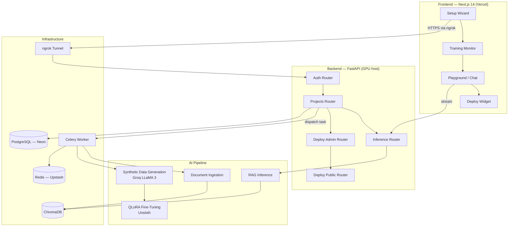
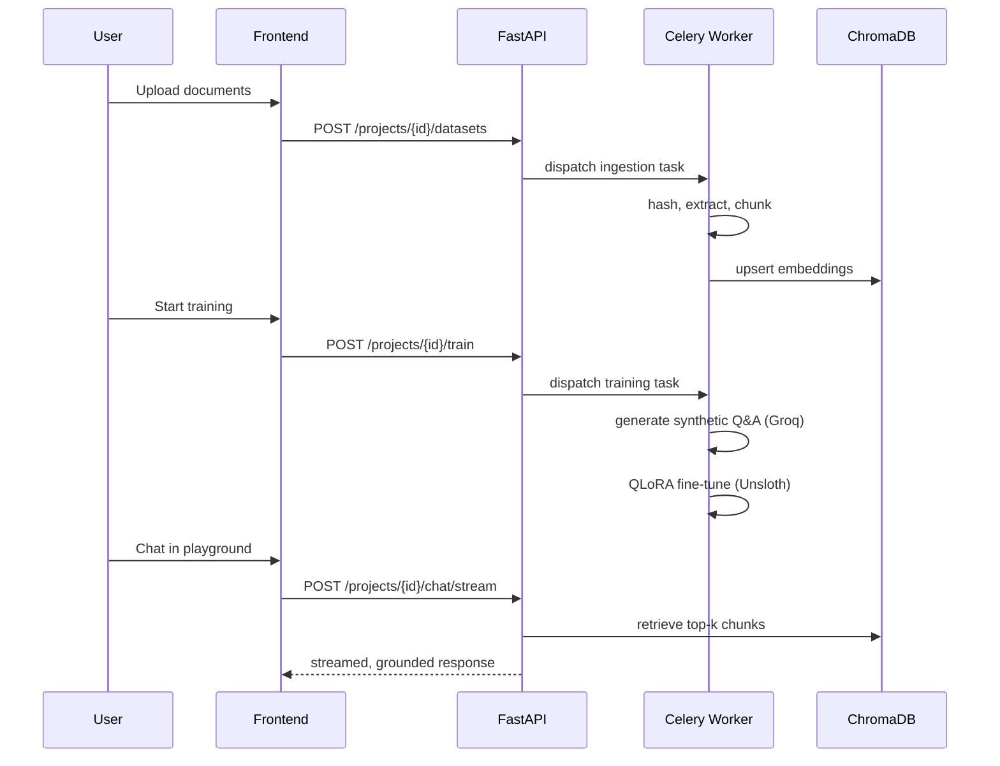

# SLM Studio

**No-code fine-tuning platform for small language models on private business data.**

SLM Studio lets non-technical users upload proprietary documents, configure a custom AI persona, and automatically fine-tune a small language model (SLM) on consumer-grade GPU hardware. Once trained, the assistant can be queried securely through a playground or deployed as an embeddable chat widget on any website.

---

## Table of Contents

- [Problem Statement](#problem-statement)
- [Key Features](#key-features)
- [Architecture](#architecture)
- [System Workflows](#system-workflows)
- [Technology Stack](#technology-stack)
- [Repository Structure](#repository-structure)
- [Getting Started](#getting-started)
- [Environment Variables](#environment-variables)
- [API Overview](#api-overview)
- [Deployment](#deployment)
- [CI](#ci)
- [Security Notes](#security-notes)
- [License](#license)

---

## Problem Statement

Small and medium enterprises face real barriers when adopting enterprise AI platforms such as GPT-4 or Gemini Pro:

1. **Cost** — subscription and per-token pricing scales directly with usage.
2. **Data privacy** — sending proprietary documents to third-party cloud APIs is a compliance and security risk.
3. **Generic responses** — off-the-shelf models lack industry-specific tone, formatting, and domain knowledge.

SLM Studio addresses this with a self-hosted, open-source platform for fine-tuning efficient 1.5B–4B parameter models on your own GPU. No document content or trained weights need to leave your infrastructure.

---

## Key Features

- **No-code fine-tuning** — upload PDFs, DOCX, or TXT files; the pipeline extracts, chunks, and synthesizes Q&A training pairs, then trains a QLoRA adapter automatically.
- **Deduplicated ingestion** — SHA-256 document hashing avoids reprocessing duplicate uploads and allows vector reuse across projects.
- **Grounded RAG pipeline** — a persistent ChromaDB store retrieves relevant context for every response, keeping the model's answers tied to your data.
- **Live training visibility** — job status, epoch progress, and streamed logs are exposed through dedicated endpoints for a real-time training monitor UI.
- **Widget deployment** — publish a trained project as a public, key-authenticated chat endpoint and embed it on any site.
- **Graceful degradation** — optional integrations (SMTP, Verifalia) fail open at call time rather than blocking core flows like signup or login when unconfigured.
- **Self-hosted by design** — the reference deployment runs the GPU workload on a rented server (Vast.ai, RTX 3090 Ti class) with no managed inference API in the loop.

---

## Architecture



The API and Celery worker run together on a GPU-equipped host and share a single Docker image; the frontend is deployed separately on Vercel and reaches the backend through an ngrok tunnel. PostgreSQL and Redis are managed services (Neon and Upstash) in the reference deployment, though the bundled `docker-compose.yml` also works with local containers for development.

### System Workflows



1. **Ingestion** — a user uploads documents; the worker computes a SHA-256 hash for deduplication, extracts and chunks the text (via a `pymupdf4llm` → Markdown pipeline), and upserts embeddings into ChromaDB.
2. **Training** — the worker generates synthetic instruction/response pairs from the chunks via the Groq API, then fine-tunes a 4-bit QLoRA adapter with Unsloth and saves it to disk.
3. **Inference** — a chat request retrieves the top-k relevant chunks from ChromaDB, hot-swaps the project's LoRA adapter into VRAM (with LRU eviction across `MAX_CACHED_BASE_MODELS`), and streams a grounded response back to the client.

---

## Technology Stack

| Category | Technology |
|---|---|
| Backend API | FastAPI 0.109, Python 3.12, Uvicorn |
| Database | PostgreSQL 15 (Neon), SQLAlchemy 2.0, Alembic |
| Task Queue | Celery 5.3, Redis 7 (Upstash) |
| Frontend | Next.js 14 (App Router), TypeScript, Tailwind CSS, Zustand, TanStack Query |
| Vector Store | ChromaDB 1.5 (persistent), hnswlib |
| Embeddings | `BAAI/bge-small-en-v1.5` (SentenceTransformers) |
| Document Parsing | pymupdf4llm, pdfplumber, python-docx, markitdown |
| Fine-Tuning | Unsloth 2026.4.8, PyTorch 2.10, HuggingFace `transformers` 5.5 / `peft` (QLoRA, 4-bit via bitsandbytes) |
| Synthetic Data | Groq API (LLaMA 3) |
| Authentication | JWT access + refresh tokens, Bcrypt |
| Tunneling | ngrok |
| CI | GitHub Actions (backend byte-compile + frontend `tsc` type-check) |

---

## Repository Structure

```
.
├── backend/
│   ├── app/
│   │   ├── main.py            # FastAPI app, middleware, startup
│   │   ├── models.py          # SQLAlchemy models
│   │   ├── schemas.py         # Pydantic request/response schemas
│   │   ├── database.py        # Engine/session setup
│   │   ├── startup_maintenance.py  # Stale Celery task / orphaned job cleanup on boot
│   │   ├── core/               # Settings (Pydantic BaseSettings), structured logging
│   │   ├── routers/            # auth, users, projects, datasets, inference, deploy_admin, deploy_public
│   │   ├── services/            # Business logic (ingestion, training, deployment)
│   │   ├── ai/                  # rag_ingestion, rag_inference, data_generator, fine-tuning pipeline
│   │   └── worker/              # Celery app and tasks
│   ├── alembic/                 # DB migrations
│   ├── requirements.txt
│   └── Dockerfile
├── frontend/
│   ├── app/                     # Next.js App Router pages
│   ├── components/              # Atomic-design component library
│   ├── stores/                  # Zustand state (auth, project, training, deploy, UI)
│   ├── hooks/                   # useChatStream, useJobs
│   ├── lib/                     # api client, constants, utils
│   └── Dockerfile
├── .github/workflows/ci.yml
├── docker-compose.yml
└── .env.example
```

---

## Getting Started

### Prerequisites

- An NVIDIA GPU with at least 8GB VRAM (for 1.5B–4B parameter models) and the NVIDIA Container Toolkit installed on the host
- Docker and Docker Compose
- A [Groq API key](https://console.groq.com) and a [Hugging Face token](https://huggingface.co/settings/tokens)
- An ngrok authtoken if you want the bundled tunnel service (`ngrok-tunnel`) to expose the API publicly

### Installation

1. **Clone the repository**

   ```bash
   git clone https://github.com/your-username/SLM-Studio.git
   cd SLM-Studio
   ```

2. **Configure environment variables**

   ```bash
   cp .env.example .env
   ```

   Fill in the required values described in [Environment Variables](#environment-variables) below.

3. **Launch the platform**

   ```bash
   docker compose up -d --build
   ```

   The `api` service builds a shared image (tagged `slm-studio-base:latest`) that the `worker` service reuses, so the first build compiles the full PyTorch/Unsloth/CUDA stack once. The worker waits on the API's `/health` check before starting.

### Accessing the Services

| Service | URL |
|---|---|
| Frontend UI | `http://localhost:3000` |
| Backend API | `http://localhost:8000` |
| API Documentation (Swagger) | `http://localhost:8000/docs` |

> **CPU-only / contract testing:** remove the `deploy:` GPU resource blocks from the `api` and `worker` services in `docker-compose.yml`. Training jobs will fail without a GPU, but auth, project creation, and document upload/ingestion will function normally.

---

## Environment Variables

All variables are validated at startup via a Pydantic `Settings` object (`backend/app/core/config.py`); unset **required** variables will prevent the API from booting.

### Required

| Variable | Purpose |
|---|---|
| `DATABASE_URL` | PostgreSQL connection string |
| `SECRET_KEY` | Signs and verifies JWT access/refresh tokens |
| `CELERY_BROKER_URL` | Redis URL used as the Celery message broker |
| `CELERY_RESULT_BACKEND` | Redis URL used to store Celery task results |
| `GROQ_API_KEY` | Synthetic training data generation |
| `HF_TOKEN` | Downloading base models from Hugging Face |

### Optional (sensible defaults)

| Variable | Default | Purpose |
|---|---|---|
| `ALGORITHM` | `HS256` | JWT signing algorithm |
| `ACCESS_TOKEN_EXPIRE_MINUTES` | `60` | Access token lifetime |
| `REFRESH_TOKEN_EXPIRE_DAYS` | `30` | Refresh token lifetime |
| `EXECUTION_MODE` | `distributed` | Task execution mode |
| `ALLOWED_ORIGINS` | `http://localhost:3000` | Comma-separated CORS allow-list (exact match, no trailing slash) |
| `PUBLIC_API_BASE_URL` | `http://localhost:8000` | Used to generate embed snippets and public chat/widget URLs |
| `FRONTEND_BASE_URL` | `http://localhost:3000` | Used for links inside outbound emails |
| `MAX_CACHED_BASE_MODELS` | — | LRU cap on base models kept resident in VRAM |
| `AUTO_CLEANUP_STALE_TASKS_ON_STARTUP` | `true` | Purges the Celery queue and resets orphaned job state on API/worker boot |
| `TOKENIZERS_PARALLELISM` | — | Set `false` to avoid tokenizer deadlocks under Celery's spawned worker pool |
| `NGROK_AUTHTOKEN` | — | Required only if using the bundled `ngrok-tunnel` service |

### Optional integrations (fail open if unset)

| Variable | Purpose |
|---|---|
| `SMTP_HOST`, `SMTP_PORT`, `SMTP_USERNAME`, `SMTP_PASSWORD`, `SMTP_FROM_EMAIL`, `SMTP_FROM_NAME`, `SMTP_USE_TLS` | Transactional email (welcome, login notification, password reset code). If unset, the app logs a warning and skips sending rather than failing the request. |
| `VERIFALIA_USERNAME`, `VERIFALIA_PASSWORD` | Email deliverability check on signup. If unset, signup skips the check entirely (fails open). |

### Managed-service convenience variables

If you're pointing at Upstash directly (e.g. for tooling outside Celery's Redis client), `UPSTASH_REDIS_REST_URL` and `UPSTASH_REDIS_REST_TOKEN` are read but not required by `Settings` — unrecognized variables are ignored (`extra="ignore"`), so it's safe to keep provider-specific extras like these or `POSTGRES_USER`/`POSTGRES_PASSWORD`/`POSTGRES_DB` in `.env` alongside the ones above.

---

## API Overview

The backend exposes REST endpoints grouped by router; interactive documentation is always available at `/docs`.

| Router | Responsibility |
|---|---|
| `auth` | Registration, email verification, login, token refresh, logout, password reset |
| `users` | Current-user profile |
| `projects` | Project CRUD, dataset attachment, training dispatch, cancellation, status, logs, job history |
| `datasets` | Dataset upload and listing, scoped to a project or globally |
| `inference` | Chat and streaming chat (ad-hoc and project-scoped), adapter unload, VRAM management, sample prompts, prewarm |
| `deploy_admin` | Create/rotate/revoke a project's public deploy key, view usage |
| `deploy_public` | Public, key-authenticated widget config and chat endpoints for embedded deployments |

---

## Deployment

The reference production setup separates GPU-bound and stateless workloads:

- **Backend + Celery worker** — a single shared Docker image running on a rented GPU instance (Vast.ai, RTX 3090 Ti class or better)
- **Frontend** — deployed on Vercel
- **PostgreSQL** — Neon (serverless Postgres)
- **Redis** — Upstash
- **Tunnel** — ngrok exposes the GPU host's API to the public frontend without a static IP; `docker-compose.yml` includes an `ngrok-tunnel` service that waits on the API's health check

Because the GPU host is typically ephemeral, treat `PUBLIC_API_BASE_URL` as something that changes between restarts unless you're on a paid ngrok tier with a reserved domain, and keep model/adapter storage on a durable volume rather than local container disk.

---

## CI

`.github/workflows/ci.yml` runs on every push and PR to `main`:

- **backend-compile** — byte-compiles `backend/app` (excluding the vendored `unsloth_compiled_cache`) to catch syntax errors and bad imports
- **frontend-typecheck** — runs `tsc --noEmit` against the frontend

This is a compile/lint gate, not a full test suite — it's intended to catch the class of bug (broken imports, type errors) that has previously reached `main`.

---

## Security Notes

- `.env` and `.env.local` are correctly excluded via `.gitignore`/`.dockerignore` — keep it that way, and never commit real values from the tables above.
- Rotate `SECRET_KEY`, `GROQ_API_KEY`, and `HF_TOKEN` immediately if this repository (or a zip/export of it) was ever shared outside your team, since a `.env` with live values has been found bundled into project exports before.
- `frontend/.vercel/` is also gitignored — it can contain a live `VERCEL_OIDC_TOKEN`. Treat any zip or archive of this repo as sensitive if it includes that folder, and avoid uploading it anywhere outside your own tooling.

