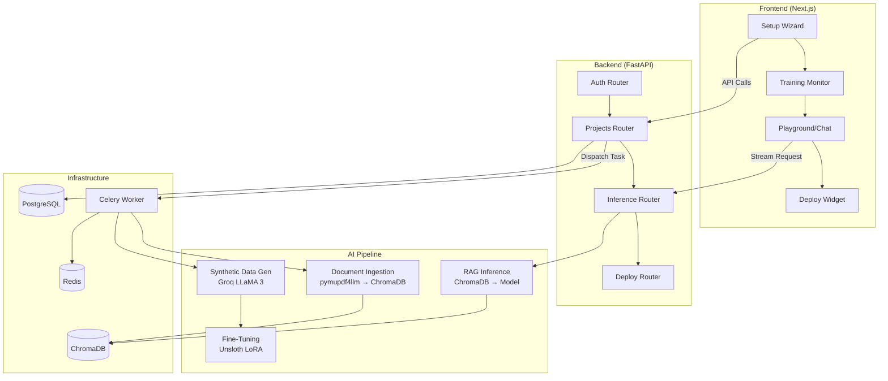

# SLM Studio

> **No-code fine-tuning platform for small language models on private business data.**

SLM Studio allows non-technical users to securely upload proprietary documents, configure a custom AI persona, and automatically fine-tune a Small Language Model (SLM) on consumer-grade GPUs. Once trained, the AI assistant can be queried securely or deployed as a chat widget on your own website.

---

## 📖 Problem Statement

Small and Medium Enterprises (SMEs) face massive barriers when adopting enterprise AI platforms (like OpenAI GPT-4 or Google Gemini Pro):
1. **Cost:** Subscription models and API token costs scale exponentially with usage.
2. **Data Privacy:** Sharing proprietary, sensitive documents with third-party cloud servers is a massive compliance and security risk.
3. **Generic Responses:** Off-the-shelf models lack industry-specific tone, formatting, and domain expertise.

**SLM Studio solves this** by providing a completely self-hosted, open-source platform. You fine-tune highly efficient 1.5B–4B parameter models on your own local GPU. **No data ever leaves your server.**

---

## ✨ Key Features

- 🚀 **No-Code Fine-Tuning:** Upload PDFs, DOCX, or TXT files. The system automatically extracts text, chunks it, generates synthetic Q&A pairs, and fine-tunes a LoRA adapter.
- 🧠 **Zero-Compute Deduplication:** Smart document hashing prevents processing duplicates and enables instant vector-reuse across multiple projects.
- 📚 **Robust RAG Pipeline:** A multi-reader PDF cascade ensures even difficult documents are parsed. ChromaDB vector search grounds all AI responses in your actual data.
- 💻 **Widget Deployment:** Deploy your newly trained assistant directly to your website with a simple `<script>` embed tag.
- 🔒 **100% Data Privacy:** Everything runs locally.

---

## 🏗️ Architecture Overview

The system is designed around a microservices architecture orchestrated by Docker Compose.



### System Workflows

1. **Project Creation & Ingestion:** User uploads documents → System computes SHA-256 hash for deduplication → Extracts text → Chunks data → Upserts into ChromaDB.
2. **Training Pipeline:** System generates synthetic training pairs from chunks → Unsloth fine-tunes a QLoRA adapter in 4-bit quantization → Saves adapter to disk.
3. **Inference & Chat:** User sends message → System retrieves top-k relevant chunks from ChromaDB → Hot-swaps the LoRA adapter into VRAM → Streams grounded response.

---

## 🛠️ Technology Stack

| Category | Technology |
|---|---|
| **Backend API** | FastAPI, Python 3.10 |
| **Database** | PostgreSQL 15, SQLAlchemy, Alembic |
| **Task Queue** | Celery, Redis 7 |
| **Frontend** | Next.js 14 (App Router), TypeScript, Tailwind CSS, Zustand |
| **Vector Store** | ChromaDB (Persistent) |
| **Embeddings** | `BAAI/bge-small-en-v1.5` (SentenceTransformers) |
| **Fine-Tuning** | Unsloth, HuggingFace `peft` (QLoRA) |
| **Synthetic Data** | Groq API |
| **Authentication** | JWT, Bcrypt |

---

## 🚦 Getting Started

### Prerequisites
- **NVIDIA GPU** (Minimum 8GB VRAM for 1.5B–4B models).
- **Docker** and `docker-compose`.
- **NVIDIA Container Toolkit** installed on the host (training and inference require CUDA).

### Installation

1. **Clone the repository:**
   ```bash
   git clone https://github.com/your-username/SLM-Studio.git
   cd SLM-Studio
   ```

2. **Configure Environment Variables:**
   Copy the example environment file and fill in your details.
   ```bash
   cp .env.example .env
   ```
   *Crucial variables to set in `.env`:*
   - `POSTGRES_PASSWORD`: Your database password.
   - `SECRET_KEY`: A secure random string for JWT encryption.
   - `GROQ_API_KEY`: Required for synthetic data generation during training.
   - `HF_TOKEN`: HuggingFace token for downloading base models.
   - `SMTP_*`: Gmail credentials if you want email verification active.

3. **Launch the platform:**
   ```bash
   docker compose up -d --build
   ```

### Accessing the Services

| Service | URL |
|---|---|
| **Frontend UI** | `http://localhost:3000` |
| **Backend API** | `http://localhost:8000` |
| **API Documentation** | `http://localhost:8000/docs` |

*(Note: To run API-only on a CPU for UI/contract testing, remove the `deploy:` GPU blocks from the `api` and `worker` services in `docker-compose.yml`. Training jobs will fail, but auth, project creation, and document uploads will function normally.)*

---

## 📜 License

[MIT License](LICENSE)
